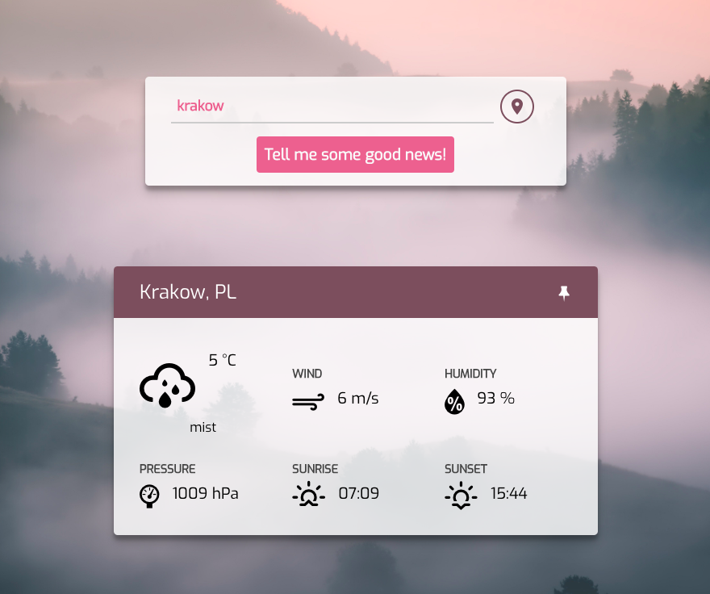

# Moody Weather
Live demo: [https://angry-leakey-e80d2d.netlify.com/](https://angry-leakey-e80d2d.netlify.com/)

Simple React Weather App built with styled components.

- weather data is fetched from [OpenWeatherMap API](https://openweathermap.org/)
- ability to find user's location
- background images based on weather condition
- pinned location loads automatically

